# Screenshots

## Demo Video

https://github.com/ugur-eren/svej/assets/86152092/0b110410-35b8-4f16-9fe3-766047432bad

## Explore

<table>
  <tr>
    <td>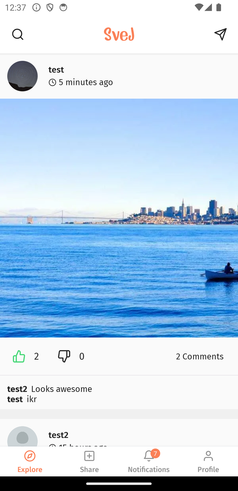</td>
    <td>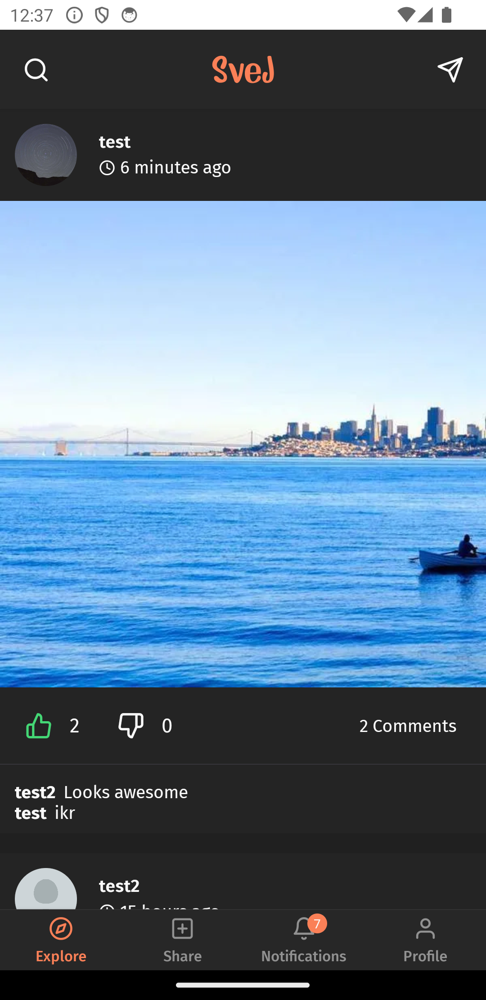</td>
  </tr>
</table>

## Profile

<table>
  <tr>
    <td>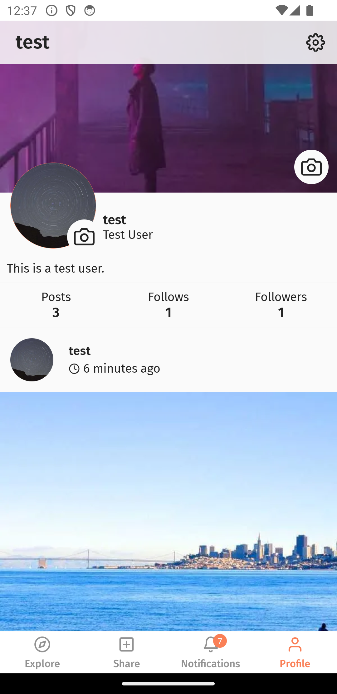</td>
    <td>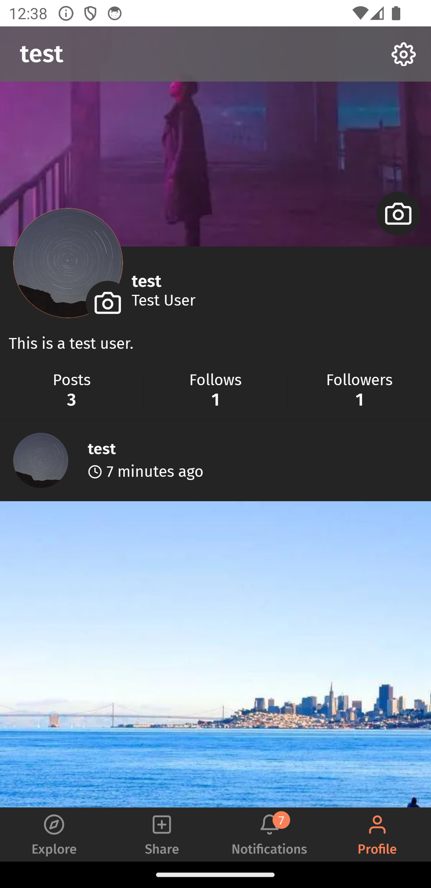</td>
  </tr>
</table>

## Chat

<table>
  <tr>
    <td>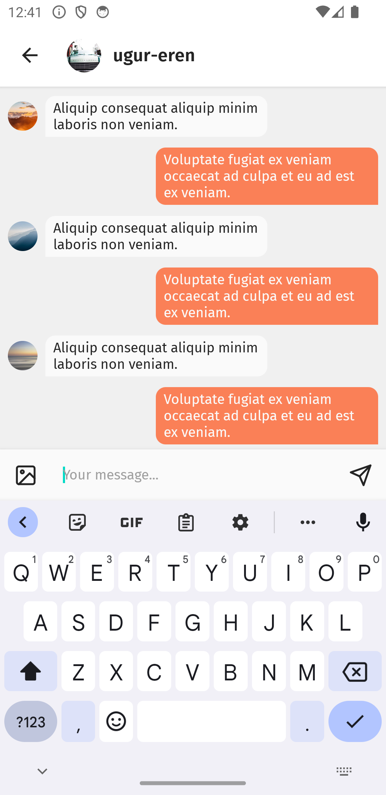</td>
    <td>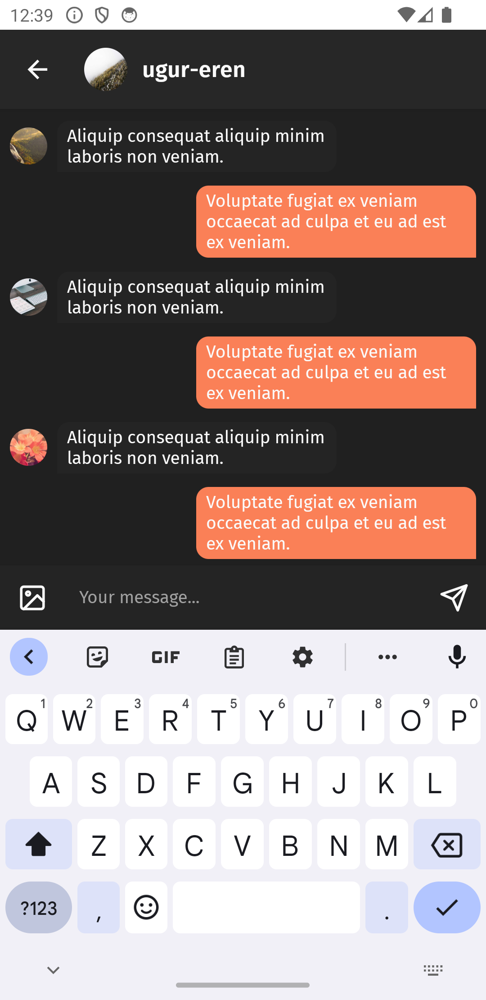</td>
  </tr>
</table>

## Comments

<table>
  <tr>
    <td>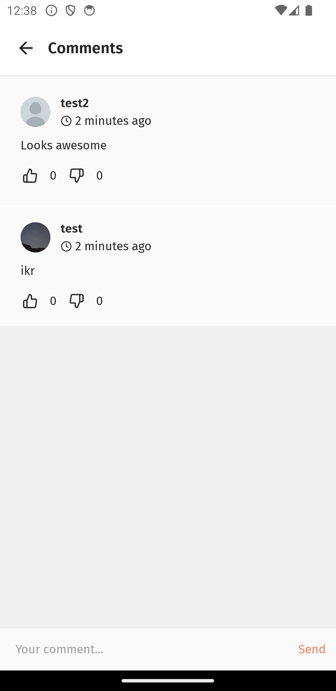</td>
    <td>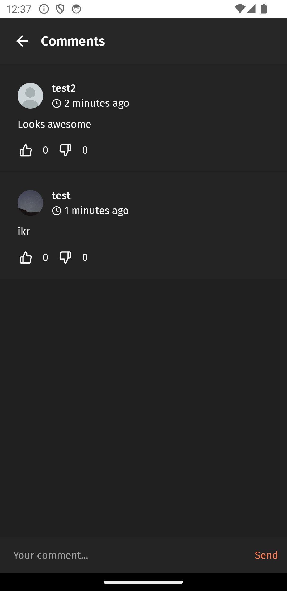</td>
  </tr>
</table>

## Share

<table>
  <tr>
    <td>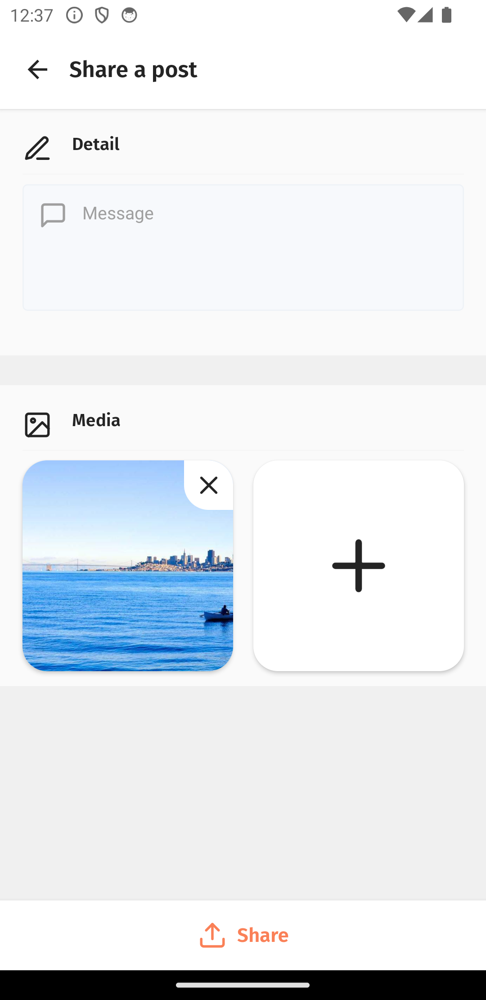</td>
    <td>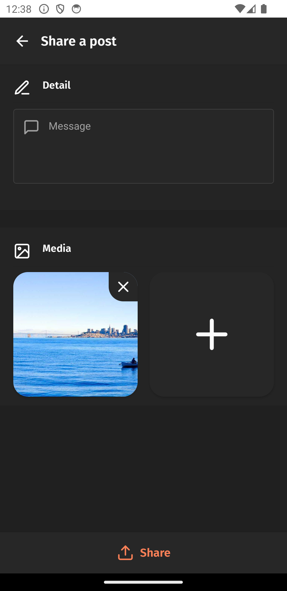</td>
  </tr>
</table>

## Notifications

<table>
  <tr>
    <td>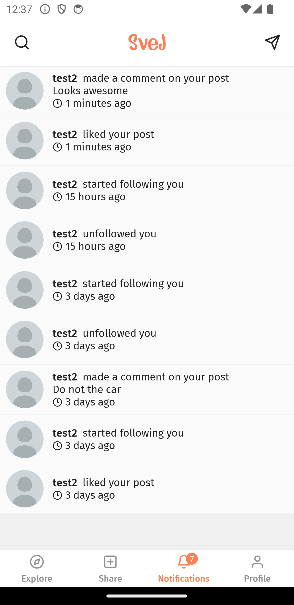</td>
    <td>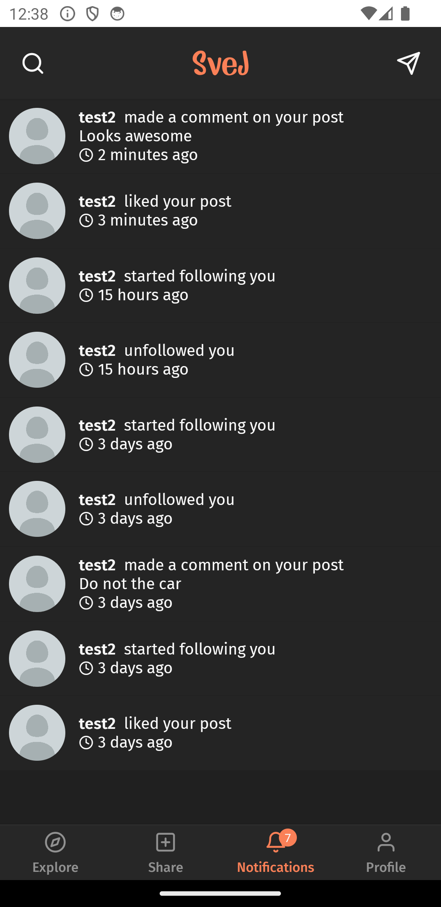</td>
  </tr>
</table>

## Settings

<table>
  <tr>
    <td>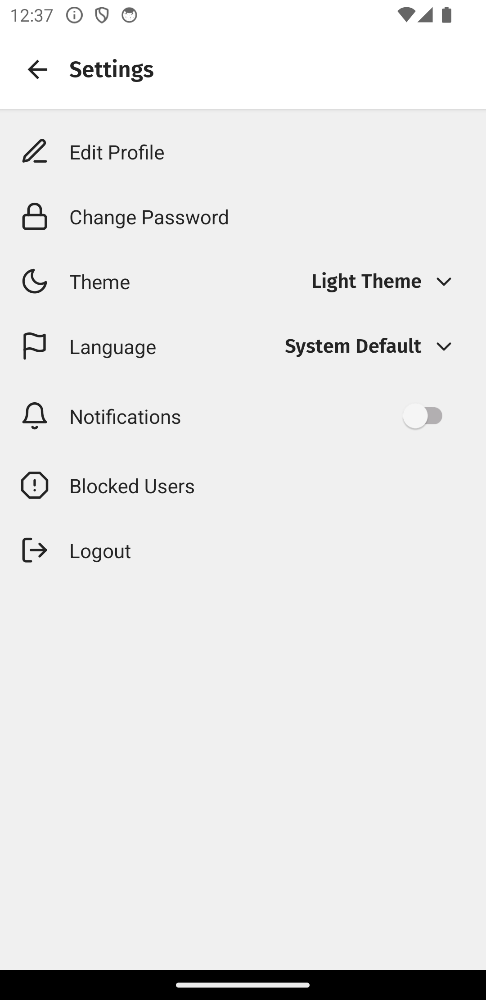</td>
    <td>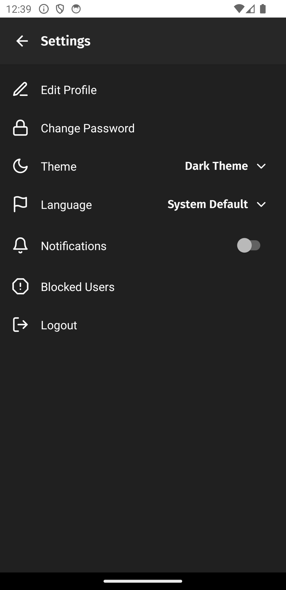</td>
  </tr>
</table>
